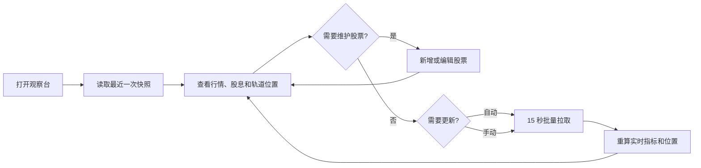
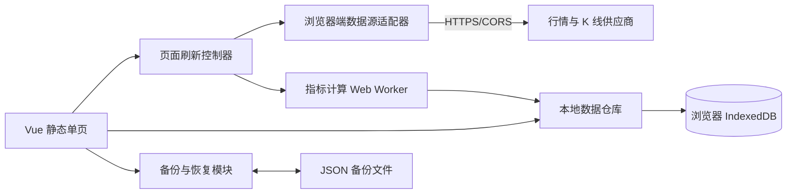
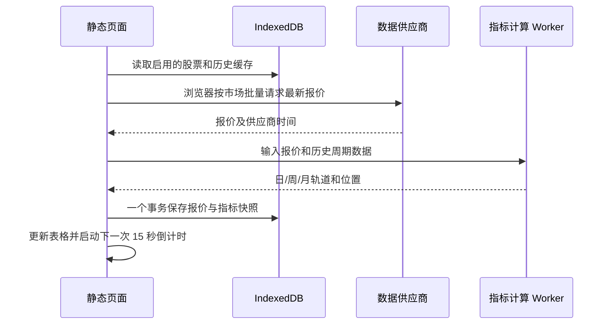

# “钱从四面八方来”股票价格与布林带监控系统设计文档

## 1. 文档信息

| 项目 | 内容 |
| --- | --- |
| 项目名称 | 钱从四面八方来 |
| 文档版本 | v1.3 |
| 文档状态 | 静态单页版产品与技术方案，待数据源和市场范围确认后进入开发 |
| 创建日期 | 2026-08-07 |
| 适用阶段 | MVP 需求评审、UI 设计、开发与验收 |

## 2. 设计结论

本系统首先做成一个可离线保存个人配置的静态单页股票观察台：用户维护自选股票、别名、备注、每股年股息和实际平均买入价；页面在交易时段每 15 秒直接更新一次最新行情，并在同一行展示按手工股息计算的股息率、日/周布林带、月线中轨、当前价格位置、买入价位置和浮动盈亏。

系统不建设业务后端和服务器数据库。程序构建后可作为静态文件复制到其他电脑；个人数据保存在当前浏览器的 IndexedDB 中，并通过版本化 JSON 备份文件迁移。迁移时导出、携带并导入备份，即可完整恢复股票、别名、手工股息、买入价、备注、排序和界面偏好。

本文档对原始需求中的术语采用以下默认解释：

1. “日上、日中、日下”指 20 日布林带上轨、中轨、下轨。
2. “周上、周中、周下”指 20 周布林带上轨、中轨、下轨。
3. “月中”指 20 月简单移动平均线，即月线布林带中轨。
4. “当前对应价格的股息”指用户手工维护每股年股息，系统仅按当前价计算股息率，不从行情源获取或推断股息。
5. “买入价在周上、周中、周下的具体位置”按当前周布林带计算，既显示所在区间，也显示精确的带宽百分位。

这些口径都做成前端本地配置，后续可调整周期和倍数，无需重做页面结构。

## 3. 建设目标与范围

### 3.1 建设目标

| 编号 | 目标 | 验收指标 |
| --- | --- | --- |
| G01 | 集中查看自选股关键行情 | 一个列表完整展示所有指定字段 |
| G02 | 及时更新股价 | 交易时段默认每 15 秒发起一次批量更新 |
| G03 | 快速判断价格所处区间 | 当前价和买入价均能显示周线区间及精确百分位 |
| G04 | 保留个人判断信息 | 支持独立的股票别名、买入价和备注字段 |
| G05 | 数据异常可感知 | 过期、缺失、停牌和数据源异常均有明确状态，不用旧数据冒充实时数据 |
| G06 | 可迁移且不丢个人数据 | 在另一台电脑导入备份后，所有股票相关个人数据逐项一致 |

### 3.2 MVP 范围

- 自选股票新增、编辑、删除、搜索、排序。
- 股票代码与交易所唯一识别，自动带出证券名称和币种。
- 股票别名单独展示和编辑。
- 备注单独展示和编辑。
- 录入实际平均买入价。
- 最新价、涨跌额、涨跌幅和行情时间。
- 手工维护每股年股息，并计算当前价股息率和买入成本股息率。
- 日线布林带上、中、下轨。
- 周线布林带上、中、下轨。
- 月线中轨。
- 当前价格的日线、周线位置。
- 买入价相对当前周布林带的精确位置。
- 每 15 秒自动刷新、手动刷新、暂停刷新。
- 行情过期和数据错误提示。
- 列显示、排序等界面偏好保存在浏览器本地。
- 独立的系统配置页面，维护刷新频率、行情状态阈值、指标参数和数据源配置。
- 全量导出、校验、预览和导入个人数据备份。
- 静态构建产物可复制到其他电脑或任意静态网站托管。

### 3.3 暂不纳入 MVP

- 自动交易、券商下单和资金账户连接。
- 投资建议、买卖信号和收益承诺。
- 分时图、K 线图、回测和策略编排。
- 多账户、多批次持仓、手续费、税费和已实现盈亏。
- 消息通知、价格预警和移动端原生 App。
- 多用户、角色权限和公开注册。
- 业务后端、服务器数据库和跨设备自动云同步。

## 4. 用户与核心场景

MVP 的主要角色为“自用投资观察者”。用户打开系统后，第一屏直接进入股票列表，不设置营销首页。

核心流程：



## 5. 指标与计算口径

### 5.1 最新价

- `current_price` 使用数据源返回的最新成交价；没有成交时使用数据源明确标识的最近价，不自行用买一价代替。
- 每条行情同时保存数据源行情时间 `quote_time` 和系统接收时间 `received_at`。
- 交易时段内，行情时间距当前超过 45 秒标记为“延迟”；超过 5 分钟标记为“过期”。阈值可配置。
- 停牌、休市和未开盘不按“更新失败”处理，要展示具体市场状态。
- 价格和收益率使用 `decimal.js` 等十进制定点库计算并以十进制字符串保存，禁止用二进制浮点数保存个人金额。

### 5.2 手工股息和股息率

股息基础值完全由用户维护。系统不从行情供应商获取分红记录，也不根据公告、历史数据或第三方字段推断股息。

MVP 的录入字段定义为“每股年股息（手工）”，单位跟随股票报价币种，例如 `元/股`、`HKD/股`、`USD/股`。系统只做以下除法：

```text
当前价股息率 = 手工每股年股息 / 当前价格 × 100%
买入成本股息率 = 手工每股年股息 / 实际平均买入价 × 100%
```

规则说明：

- 手工每股年股息允许为空或大于等于 0，不允许负数，最多 8 位小数。
- 空值表示“尚未维护”，每股股息和股息率均显示 `--`。
- 用户明确录入 `0` 才表示“无股息”，股息率显示 `0.00%`；不能把空值当成 0。
- 当前价格更新时重新计算当前价股息率，手工每股年股息本身不会被自动修改。
- 修改买入价时重新计算买入成本股息率。
- 系统记录 `dividend_updated_at`，列表提示中显示股息最后维护时间，便于用户判断是否需要更新。
- 拆股、合股、送转、派息政策变化及税前税后口径均由用户判断并手工更新，系统不自动校正。
- 为避免口径误解，页面字段固定标注“手工股息”，详情提示固定说明“按你维护的每股年股息计算”。

### 5.3 日、周、月布林带

默认参数为 `N = 20`、`K = 2`：

```text
中轨 MB = 最近 N 个周期收盘价的简单移动平均值 SMA(N)
标准差 SD = 最近 N 个周期收盘价的总体标准差（ddof = 0）
上轨 UB = MB + K × SD
下轨 LB = MB - K × SD
```

周期口径：

| 指标 | 样本 | 页面字段 |
| --- | --- | --- |
| 日布林带 | 19 个已完成交易日 + 当前交易日实时价 | 日上、日中、日下、日位置 |
| 周布林带 | 19 个已完成交易周 + 本周实时价 | 周上、周中、周下、周位置、买入位置 |
| 月线中轨 | 19 个已完成交易月 + 本月实时价 | 月中 |

交易时段内，上述指标属于“实时预估值”，会随最新价更新；周期收盘后成为完成值。表头提示中必须明确当前是“盘中预估”还是“收盘值”。

价格序列默认使用前复权收盘价，并确保最后一个点与当前价格处于同一量纲。不得混用不复权现价和复权历史价。若数据源无法提供可靠复权因子，则整体退回不复权口径并在行详情的口径提示中说明。

不足 20 个有效周期时，对应轨道显示 `--` 和“历史数据不足”，不以较短周期偷偷替代。

### 5.4 价格在布林带中的精确位置

对任意价格 `P`，以周下轨 `LB`、周上轨 `UB` 计算统一带宽百分位：

```text
BB% = (P - LB) / (UB - LB) × 100%
```

| BB% | 区间标签 | 页面显示示例 |
| ---: | --- | --- |
| `< 0%` | 周下轨下方 | `-8.2% · 下轨下方` |
| `= 0%` | 周下轨 | `0.0% · 下轨` |
| `0% ~ 50%` | 周下至周中 | `31.4% · 下→中` |
| `= 50%` | 周中轨 | `50.0% · 中轨` |
| `50% ~ 100%` | 周中至周上 | `72.4% · 中→上` |
| `= 100%` | 周上轨 | `100.0% · 上轨` |
| `> 100%` | 周上轨上方 | `112.3% · 上轨上方` |

为了回答“在中轨到上轨之间走了多少”，详情提示再显示分段进度：

```text
下轨到中轨进度 = BB% × 2                    （0% < BB% < 50%）
中轨到上轨进度 = (BB% - 50%) × 2            （50% < BB% < 100%）
```

例如 `BB% = 72.4%`，表示价格位于周中轨与周上轨之间，并从中轨向上轨走了 `44.8%`。

系统分别计算：

- `current_week_position`：用当前价 `P = current_price` 计算。
- `buy_week_position`：用实际平均买入价 `P = average_buy_price`，相对“当前周轨”计算。

买入位置会随周轨变化，这并不代表买入价发生变化。页面提示文案固定为“买入价相对当前周轨”。未来若需要还原买入当时的位置，必须同时记录买入日期并查询历史周轨，作为二期功能处理。

当 `UB = LB` 或任一轨道缺失时位置不可计算，显示 `--`。

### 5.5 浮动盈亏

```text
浮动盈亏率 = (当前价 - 实际平均买入价) / 实际平均买入价 × 100%
```

MVP 不计手续费、税费、汇率和分红再投资。没有买入价时不显示盈亏和买入位置。

## 6. 功能设计

### 6.1 股票观察列表

列表使用固定表头、横向滚动和两级分组表头，默认按用户排序号展示。股票信息列固定在左侧，操作列固定在右侧。

| 分组 | 列名 | 说明 | 默认显示 |
| --- | --- | --- | --- |
| 股票 | 代码/市场 | 如 `600519.SH`、`00700.HK` | 是 |
| 股票 | 股票名称 | 数据源标准名称，只读 | 是 |
| 股票 | 别名 | 用户自定义，独立一列 | 是 |
| 行情 | 当前价 | 带币种、行情状态和新旧状态 | 是 |
| 行情 | 涨跌幅 | 相对前收盘价 | 是 |
| 股息 | 手工每股年股息 | 用户维护的股息基础值 | 是 |
| 股息 | 当前价股息率 | 手工股息 / 当前价 | 是 |
| 股息 | 成本股息率 | 手工股息 / 买入价 | 否 |
| 日线 | 日上 | 20 日布林带上轨 | 是 |
| 日线 | 日中 | 20 日布林带中轨 | 是 |
| 日线 | 日下 | 20 日布林带下轨 | 是 |
| 日线 | 日位置 | 当前价的日线 BB% 与区间 | 否 |
| 周线 | 周上 | 20 周布林带上轨 | 是 |
| 周线 | 周中 | 20 周布林带中轨 | 是 |
| 周线 | 周下 | 20 周布林带下轨 | 是 |
| 周线 | 周位置 | 当前价的周线 BB% 与区间 | 是 |
| 周线 | 买入位置 | 买入价相对当前周轨的位置 | 是 |
| 月线 | 月中 | 20 月中轨 | 是 |
| 持仓 | 实际买入价 | 用户录入的平均买入价 | 是 |
| 持仓 | 浮动盈亏 | 未考虑费用的价格收益率 | 是 |
| 记录 | 备注 | 单独一列，列表截断、悬停看全文 | 是 |
| 状态 | 更新时间 | 数据源行情时间 | 是 |
| 操作 | 编辑/删除 | 图标按钮配工具提示 | 是 |

交互规则：

- 支持按代码、名称、别名搜索。
- 支持按当前价、涨跌幅、股息率、周位置、买入位置和浮动盈亏排序。
- 支持按市场、行情状态、周位置区间筛选。
- 价格闪动只持续约 600 毫秒，涨跌不能只依赖颜色，同时显示正负号。
- 中国市场默认红涨绿跌；可在系统配置页切换颜色规则。
- 表格单元格展示 2～4 位小数，悬停显示完整精度、指标口径和行情时间。
- 用户隐藏列、列宽、排序和全部个人业务数据均存储在浏览器本地。

### 6.2 新增股票

点击工具栏“新增”打开右侧抽屉：

| 字段 | 必填 | 规则 |
| --- | --- | --- |
| 市场 | 是 | A 股、港股、美股等，最终选项取决于数据源 |
| 股票代码 | 是 | 输入后防抖查询并选择标准证券，不能仅凭文本保存 |
| 股票名称 | 自动 | 由证券主数据带出，只读 |
| 别名 | 否 | 最长 50 字符 |
| 每股年股息（手工） | 否 | 大于等于 0，最多 8 位小数；单位跟随报价币种 |
| 实际平均买入价 | 否 | 大于 0，最多 6 位小数 |
| 备注 | 否 | 最长 1000 字符 |

同一观察列表不允许重复添加相同的 `市场 + 股票代码`。添加成功后先显示“数据加载中”，页面立即拉取该证券历史 K 线和最新价；任一子任务失败不回滚股票记录，页面分别提示缺失项并允许重试。手工股息随观察项直接保存，不参与行情加载。

### 6.3 编辑与删除

- 别名、手工股息、买入价和备注可在编辑抽屉中修改。
- 股票代码和市场不可直接修改，避免历史数据串号；需要换代码时删除后重新添加。
- 删除前二次确认，默认软删除观察项，不删除共享证券行情和历史数据。
- 买入价清空后，成本股息率、买入位置和浮动盈亏立即显示 `--`。

### 6.4 自动刷新

- 页面中的单例刷新器是唯一的行情轮询发起方，浏览器直接访问允许跨域调用的第三方行情接口。
- 默认刷新间隔 15 秒，从上一次任务完成后计时，避免慢请求堆积。
- 数据源支持批量报价时，按市场和供应商限制分批获取，不逐只请求。
- 同一轮刷新未完成时跳过下一轮，保证单任务运行。
- 交易时段按 15 秒刷新；休市时默认停止实时轮询，仅在开市前、收市后执行必要同步。
- 每轮成功响应后在页面内重算指标并更新 IndexedDB 快照，不使用 SSE 或 WebSocket。
- 页面提供刷新倒计时、立即刷新和暂停/继续按钮。暂停后只停止当前页面轮询。
- 浏览器标签恢复可见时立即校验快照版本，避免展示休眠前数据。
- 同一浏览器打开多个标签时，通过 Web Locks API 选举一个行情刷新标签，并用 BroadcastChannel 通知其他标签读取新快照；不支持 Web Locks 时只允许可见标签轮询。

### 6.5 数据备份与电脑迁移

浏览器本地存储不会随着 HTML 文件自动复制，因此迁移功能是 MVP 必做项，不能只依赖 IndexedDB。

导出备份：

- 工具栏提供“导出备份”按钮，下载 `钱从四面八方来-backup-YYYYMMDD-HHmmss.json`。
- 备份包含股票标识、别名、手工每股年股息、股息维护时间、买入价、备注、排序、启用状态、界面偏好和指标配置。
- 最新报价、历史 K 线和计算缓存默认不导出；这些数据体积大且可在新电脑重新获取。
- 文件包含 `schema_version`、`exported_at`、应用版本、记录数和内容校验值。
- 每次个人数据修改后标记“有未备份改动”；成功导出后清除提醒。

导入恢复：

- 用户选择备份 JSON 后，页面先校验文件结构、版本、字段范围和校验值，不直接写入。
- 导入预览显示新增、更新、冲突、跳过和错误数量。
- 支持“合并导入”和“全部替换”两种方式；默认使用合并导入。
- 冲突以 `交易所 + 股票代码` 识别。合并模式下默认采用备份中的个人字段，导入前明确展示差异。
- 全部替换前，页面自动下载当前数据的安全备份；若浏览器阻止下载，则不执行替换。
- 写入过程使用单个 IndexedDB 事务，任一条失败时整体回滚。
- 导入成功后重新拉取行情和历史 K 线，不改变已恢复的个人字段。

迁移步骤固定为：旧电脑导出备份 → 复制静态程序和备份文件 → 新电脑打开页面 → 导入备份 → 核对记录数并刷新行情。

### 6.6 数据状态

每行独立显示以下状态之一：

| 状态 | 含义 | 页面表现 |
| --- | --- | --- |
| 实时 | 交易时段且行情在新鲜度阈值内 | 正常展示 |
| 延迟 | 行情超过 45 秒 | 黄色状态图标和具体时间 |
| 过期 | 行情超过 5 分钟 | 灰化当前价，禁止闪动 |
| 休市 | 市场当前不开盘 | 显示最近收盘时间 |
| 停牌 | 数据源明确返回停牌 | 显示停牌，不归为错误 |
| 历史不足 | 少于指标所需周期 | 相关轨道显示 `--` |
| 部分缺失 | 行情或指标只有部分可用 | 可用数据保留，缺失项单独说明 |
| 更新失败 | 本轮供应商调用失败 | 保留上次值并显式标旧，不清空整行 |

## 7. 页面设计

### 7.1 页面数量与结构

MVP 严格按独立路由计算有 **2 个页面**，另外包含 **2 个页面内抽屉**和导入相关模态框：

| 类型 | 名称 | 独立路由 | 用途 |
| --- | --- | --- | --- |
| 页面 | 钱从四面八方来 | `#/` 或静态 `index.html` | 搜索、筛选、查看全部股票数据和执行操作 |
| 页面 | 系统配置 | `#/settings` | 维护刷新频率、数据新鲜度、布林带参数、数据源和迁移设置 |
| 抽屉 | 新增/编辑股票 | 无 | 维护股票、别名、手工股息、买入价和备注 |
| 抽屉 | 股票详情 | 无 | 查看行情时间、指标口径、位置刻度和计算明细 |

导入预览和替换确认使用模态框，也不计为独立页面。MVP 不建设登录页、营销首页或独立详情页。

### 7.2 桌面端主页面线框

```text
┌──────────────────────────────────────────────────────────────────────────────┐
│ 钱从四面八方来       ● 行情已连接 最近更新 10:25:30 [配置] [备份] [导入] [+]   │
├──────────────────────────────────────────────────────────────────────────────┤
│ [搜索代码/名称/别名................] [市场⌄] [周位置⌄] [列设置]  共 18 只     │
├───────────────┬──────────┬──────────┬──────────────────┬─────────────────────┤
│ 股票          │ 行情     │ 股息     │ 日线             │ 周线                │
├──────┬────────┼────┬─────┼────┬─────┼────┬────┬────┬───┼────┬────┬────┬─────┤
│代码  │别名    │现价│涨幅 │股息│率   │上  │中  │下  │位置│上  │中  │下  │周位置│ ...
├──────┼────────┼────┼─────┼────┼─────┼────┼────┼────┼───┼────┼────┼────┼─────┤
│600519│核心消费│... │...  │... │...  │... │... │... │...│... │... │... │72.4%│ ...
│00700 │腾讯    │... │...  │... │...  │... │... │... │...│... │... │... │43.1%│ ...
└──────┴────────┴────┴─────┴────┴─────┴────┴────┴────┴───┴────┴────┴────┴─────┘
```

`+`、配置、备份、导入、刷新、暂停和列设置使用图标按钮，并提供工具提示；筛选器使用菜单或选择框，不使用装饰性卡片。刷新倒计时和连接状态放在表格上方的工具栏中。

### 7.3 行详情

点击非编辑单元格打开行详情抽屉，按以下顺序展示：

1. 证券名称、代码、市场状态、行情时间和数据来源。
2. 当前价、前收盘、涨跌额、涨跌幅。
3. 手工每股年股息、最后维护时间及当前价/买入成本股息率公式。
4. 日、周布林带数值和当前价位置刻度。
5. 买入价在当前周轨中的刻度、分段进度和浮动盈亏。
6. 别名、备注和最近修改时间。

位置刻度使用一条稳定宽度的水平标尺，标明下轨 `0%`、中轨 `50%`、上轨 `100%`。超出轨道时指针停在边界并用文字给出真实 BB%，避免拉伸布局。

### 7.4 响应式策略

- 桌面端（宽度 ≥ 1200px）使用完整宽表格。
- 平板端保留固定的代码、别名、当前价和周位置，其余横向滚动。
- 手机端 MVP 仍使用可横向滚动的紧凑表格，并提供列方案“核心/指标/持仓”；不把每行改成多层嵌套卡片。
- 所有数值列使用稳定列宽，加载、错误和长文本不能导致表格跳动。

### 7.5 系统配置页面

系统配置是独立路由页面，但仍是静态前端配置，不代表服务器后台。页面采用参考项目的“页面标题 + 分段工具区 + 表单分组”结构，保存后写入 IndexedDB，并将非敏感配置纳入 JSON 备份。

#### 7.5.1 行情刷新配置

| 配置项 | 控件 | 默认值 | 校验与行为 |
| --- | --- | ---: | --- |
| 刷新间隔 | 数字输入/步进器 | 15 秒 | 整数，5～3600 秒；低于数据源最小间隔时阻止保存 |
| 延迟阈值 | 数字输入/步进器 | 45 秒 | 必须小于过期阈值 |
| 过期阈值 | 数字输入/步进器 | 300 秒 | 必须大于延迟阈值 |
| 交易时段轮询 | 开关 | 开启 | 关闭后交易时段也不自动请求，只保留手动刷新 |
| 休市轮询 | 开关 | 关闭 | 默认不在休市时轮询 |
| 失败重试次数 | 数字输入 | 2 次 | 单轮最多重试，防止请求堆积 |

保存后立即更新主页面倒计时；当前正在执行的请求不强行中断，下一轮使用新间隔。页面展示供应商要求的最小间隔，用户不能保存会触发限流的值。

#### 7.5.2 指标口径配置

| 配置项 | 控件 | 默认值 |
| --- | --- | --- |
| 布林带周期 N | 数字输入 | 20 |
| 标准差倍数 K | 数字输入 | 2 |
| 标准差口径 | 下拉框 | 总体标准差 `ddof=0` |
| 历史价格 | 下拉框 | 前复权 |
| 月线展示 | 开关 | 仅月中 |

修改指标参数前显示影响说明：保存后需要重算全部本地 K 线缓存，旧快照会暂时标记为“重算中”。

#### 7.5.3 数据源配置

- 供应商选择、行情接口地址、历史 K 线接口地址和市场映射使用表单维护。
- API 密钥输入框默认密码样式，并明确提示“静态页面无法真正隐藏密钥”；密钥单独保存且不导出。
- 提供“测试连接”按钮，仅请求证券搜索或单只测试股票，不触发全量刷新。
- 显示 CORS 检测、最近成功时间、接口延迟、剩余限额（供应商提供时）和当前错误。
- 只允许配置预置供应商域名，避免把任意 URL 当作可信数据源。

#### 7.5.4 数据迁移与本地存储

- 显示 IndexedDB 使用量、观察项数量、行情缓存大小和最近备份时间。
- 提供“导出备份”“导入备份”“清理行情缓存”“恢复默认配置”按钮。
- 清理行情缓存不删除股票、别名、手工股息、买入价和备注。
- 恢复默认配置需要二次确认；只恢复刷新和指标设置，不删除个人股票数据。
- 页面顶部显示“已保存”“有未保存修改”状态，关闭或切换页面前提示。

### 7.6 视觉参考与采用规则

UI 参考目录：`C:\Users\Administrator\Desktop\指导人test\frontend\src`。参考项目体现的是成熟的企业运营后台风格，本项目采用其视觉基础和交互节奏，不照搬指导人业务内容。

| 参考点 | “钱从四面八方来”的采用方式 |
| --- | --- |
| 页面壳层 | 248px 左侧导航、64px 顶栏、24px 内容内边距；导航只保留“股票观察台”和“系统配置” |
| 背景与表面 | 浅蓝灰页面底 `#f3f6fb`，白色内容表面，细边框 `#d9e1ee`，弱阴影用于分组边界 |
| 主色 | 深蓝 `#0b4fb0` 用于主按钮、选中导航和链接；青绿色用于连接/成功状态；琥珀色用于延迟和提醒 |
| 控件尺寸 | 普通控件圆角 4px，分组区域圆角 8～10px；按钮、输入框和表格行保持稳定高度 |
| 工具栏 | 标题、搜索、筛选、列设置和操作按钮按参考项目的左右分组排列，支持换行 |
| 表格 | 使用带边框的宽表格容器，横向滚动，代码/别名/当前价固定，操作列固定在右侧 |
| 抽屉 | 右侧抽屉承载编辑和详情，顶部标题、分组区块、底部固定操作区；不把抽屉内容再套成多层卡片 |
| 状态 | 上涨/下跌、实时/延迟/过期同时使用颜色、文字和图标，不能只靠颜色传达 |
| 空状态 | 使用简洁的空状态和下一步操作，不放营销插画或大面积装饰 |

保留参考项目的高密度、可扫描、重复操作友好特征；去除登录、通知中心、审批流程、角色切换等与本系统无关的导航和页面。

## 8. 系统架构

### 8.1 推荐技术栈

| 层级 | 推荐选型 | 原因 |
| --- | --- | --- |
| 前端 | Vue 3 + TypeScript + Vite + Element Plus | 适合国内团队和高密度表格管理界面 |
| 数据请求 | 浏览器原生 Fetch + AbortController | 直接访问支持 CORS 的行情接口，支持超时取消 |
| 本地数据库 | IndexedDB + Dexie.js | 容量大、支持索引和事务，适合保存观察项及 K 线缓存 |
| 精确数值 | decimal.js | 计算手工股息率、买入价和盈亏，避免金额精度问题 |
| 指标计算 | 经固定样本验证的 JavaScript 指标库 | 避免手写滚动统计造成边界错误 |
| 后台计算 | Web Worker | 股票较多时不阻塞表格交互 |
| 调度 | 页面内单例 RefreshController | 管理 15 秒轮询、超时、暂停和标签页状态 |
| 构建 | Vite 静态构建，可选单文件打包插件 | 产出无需业务服务器的 HTML/CSS/JS |

不使用 FastAPI、PostgreSQL、Redis、SSE、Docker 或业务服务器。第三方库必须打入构建产物，不依赖运行时 CDN，保证换电脑后应用文件本身可用。

无论使用哪一个指标库，都必须通过固定样本测试确认 `ddof`、缺失值、复权和未完成周期口径。

### 8.2 组件关系



### 8.3 一轮刷新时序



K 线不是每 15 秒全量请求。推荐调度：

- 最新报价：交易时段每 15 秒。
- 当日/当周/当月未完成 K 线：由最新价和供应商周期数据更新，必要时每 1～5 分钟校准。
- 已完成日 K：每个市场收盘后同步一次。
- 周/月聚合：由日 K 本地聚合，并在周/月收盘后固化。
- 证券主数据和交易日历：每日一次。

### 8.4 静态构建与运行方式

构建产物推荐提供两种形式：

1. `dist/index.html` 单文件版：CSS、JavaScript 和字体全部内嵌，最容易复制。
2. `dist/` 标准静态目录版：适合部署到 Nginx、GitHub Pages、对象存储或公司静态站点。

路由使用 Hash History（`#/`、`#/settings`），不依赖服务器配置 history fallback；复制目录、静态托管和直接打开文件时都能进入系统配置页。

单文件版可以尝试直接双击打开，但能否在 `file://` 下获取行情取决于供应商是否接受空来源 `Origin: null`。可靠运行方式是通过任意静态文件服务以 `http://localhost` 或 HTTPS 打开；静态文件服务只负责发送文件，不保存任何股票数据，也不属于业务后端。

便携包建议包含：

```text
钱从四面八方来/
├─ index.html
├─ 使用说明.txt
└─ backups/
   └─ 钱从四面八方来-backup-YYYYMMDD-HHmmss.json
```

复制程序目录本身不会复制浏览器 IndexedDB。迁移前必须导出备份，或者在新电脑导入最近一次备份。该限制要在使用说明和页面备份提醒中明确展示。

## 9. 数据源设计

数据源必须至少覆盖以下能力：

| 能力 | 必要字段 |
| --- | --- |
| 证券搜索 | 市场、代码、名称、币种、上市状态 |
| 最新报价 | 最新价、前收盘、行情时间、交易状态 |
| 历史日 K | 交易日、OHLC、成交量、复权因子或前复权价 |
| 交易日历 | 市场、日期、开收盘时间、休市安排、时区 |

前端定义统一 `MarketDataProvider` 接口，页面组件不直接依赖某一家供应商字段。供应商原始响应只在内存中短期用于排错，标准化后的行情和 K 线才写入 IndexedDB。

纯静态模式对数据源有以下硬性要求：

- 必须支持浏览器 HTTPS 请求和 CORS，允许实际静态站点来源；若要双击运行，还需允许 `Origin: null`。
- 必须允许每 15 秒批量轮询、浏览器端缓存和个人页面展示。
- 若需要 API 密钥，密钥会存在浏览器环境中，无法像后端服务那样保密。只能使用供应商允许放在前端、可限制来源/额度的密钥。
- 密钥保存在单独的本地设置记录中，默认不写入股票备份文件；换电脑后重新录入。
- 免费网页接口通常存在稳定性、限流和授权风险，不能把抓取网页或绕过 CORS 作为正式方案。

数据源优先级建议：

1. 明确支持浏览器调用、批量报价和目标市场的合法供应商。
2. 不需要秘密密钥，或能使用来源受限前端密钥的供应商。
3. 能同时覆盖目标市场、实时行情和历史复权行情的单一供应商。
4. 若必须组合供应商，以证券标识映射隔离代码差异，并记录每个字段的来源。

### 9.1 数据来源路线决策

| 路线 | 适用性 | 优点 | 风险/限制 | 本项目结论 |
| --- | --- | --- | --- | --- |
| 有授权、支持 CORS 的行情 API | A 股/港股/美股正式使用 | 数据质量、授权和稳定性最好 | 可能收费，需确认前端密钥策略 | 首选 |
| 有授权但只支持服务端密钥的 API | 对数据质量要求高 | 通常覆盖完整、限制清晰 | 必须增加代理，不能保持纯静态 | 作为静态方案失败时的降级 |
| 公共网页行情接口或非官方接口 | 原型和演示 | 接入快、成本低 | CORS、限流、字段变更和授权风险 | 只允许开发验证，不作为生产依赖 |
| 用户导入 CSV/JSON 行情 | 离线查看或供应商故障 | 不受跨域影响，可留存快照 | 不能提供 15 秒实时价 | 作为离线兜底，不替代实时源 |

在没有明确市场和供应商前，不能在文档中虚构一个固定接口。实现时应先使用 `MockMarketDataProvider` 完成页面、缓存、指标和迁移开发，再将真实供应商接入同一适配器，不改页面和业务逻辑。

### 9.2 上线前数据源验收清单

真实静态地址确定后，从该地址在 Chrome/Edge 中逐项验证：

1. `searchSecurities`、`getQuotes`、`getDailyBars` 是否全部支持 HTTPS 和 CORS。
2. 是否能按市场批量请求报价，且供应商允许的最小间隔不大于系统配置的刷新间隔。
3. 是否返回交易状态、行情时间、前收盘和停牌状态，而不是只返回一个价格。
4. 是否提供足够的前复权日 K 线，能够本地生成周线和月线。
5. 供应商时间、交易所时区和系统时间是否能正确对齐。
6. API 密钥是否允许出现在浏览器；若不允许，立即切换“静态页面 + 代理”方案，不把密钥硬编码进 HTML。
7. 记录每分钟限额、失败重试规则、缓存许可和页面展示许可，并在系统配置页显示当前供应商。

### 9.3 推荐落地顺序

第一步不依赖真实行情源，使用本地固定 JSON 样本验证 UI 和指标；第二步接入一个目标市场的浏览器兼容供应商；第三步连续运行一个完整交易日，观察 15 秒刷新、限流和过期状态；只有通过授权、CORS、准确性和稳定性检查后，才把该源设为默认供应商。

## 10. 数据模型

### 10.1 IndexedDB 对象仓库

#### `watchlist` 观察项与个人数据

主键为 `security_key = exchange + ':' + symbol`，例如 `SSE:600519`。

| 字段 | 存储类型 | 说明 |
| --- | --- | --- |
| `security_key` | string | 主键，跨电脑稳定识别同一证券 |
| `market` / `exchange` / `symbol` | string | 市场和标准代码 |
| `name` / `currency` / `timezone` | string | 证券主数据快照 |
| `alias` | string | 股票别名 |
| `note` | string | 备注，最长 1000 字符 |
| `manual_annual_dividend_per_share` | string/null | 手工每股年股息，十进制字符串 |
| `dividend_updated_at` | ISO string/null | 手工股息维护时间 |
| `average_buy_price` | string/null | 实际平均买入价，十进制字符串 |
| `sort_order` | number | 用户排序 |
| `enabled` | boolean | 是否参与刷新 |
| `created_at` / `updated_at` | ISO string | 创建/修改时间 |

#### `quotes` 最新行情缓存

| 字段 | 存储类型 | 说明 |
| --- | --- | --- |
| `security_key` | string | 主键 |
| `current_price` / `previous_close` | string | 最新价和前收盘，十进制字符串 |
| `change_amount` / `change_percent` | string | 涨跌数据 |
| `trade_status` | string | 交易中、休市、停牌等 |
| `quote_time` / `received_at` | ISO string | 行情时间和接收时间 |
| `provider` | string | 数据来源 |

#### `price_bars` 周期行情缓存

复合主键为 `[security_key+period+period_start]`，字段包含前复权 OHLC、成交量、周期范围、完成状态和供应商。只保留计算和恢复首屏所需的合理历史窗口，超期缓存可清理后重新拉取。

#### `indicator_snapshots` 指标快照

主键为 `security_key`，保存日上中下、周上中下、月中、当前日/周 BB%、样本数、盘中预估标志、计算时间和算法版本。买入位置和浮动盈亏在读取观察项时即时计算。

#### `app_settings` 本地设置

保存刷新间隔、过期阈值、布林带参数、颜色规则、列宽、列显隐、筛选和最近导出时间。数据源密钥单独标记为 `sensitive`，默认从迁移备份排除。

### 10.2 备份文件结构

备份以观察项和用户设置为核心，结构示例：

```json
{
  "app": "钱从四面八方来",
  "schema_version": 1,
  "exported_at": "2026-08-07T02:30:00.000Z",
  "app_version": "1.0.0",
  "record_count": 2,
  "checksum": "sha256:...",
  "watchlist": [],
  "settings": {}
}
```

校验值基于去除 `checksum` 字段后的规范化 JSON 计算。导入器必须支持当前版本和明确列出的旧版本；不认识的新版本直接拒绝，不猜测字段。

### 10.3 数据一致性

- 一轮刷新先在内存中完成校验和计算，再用一个 IndexedDB 事务更新报价与指标快照。
- 每轮刷新带递增的本地 `snapshot_version`，只接收更高版本，避免慢响应覆盖新数据。
- 指标快照记录算法版本；参数变化后触发全量重算。
- 时间统一保存为 UTC ISO 8601 字符串，页面按交易所或用户时区显示。
- 观察项修改和导入使用事务；失败时回滚，不能留下半条股票记录。
- 页面升级通过 IndexedDB schema migration 迁移数据；迁移前提示用户先导出备份。

## 11. 前端模块接口

静态版没有自有 REST API。模块之间通过 TypeScript 接口隔离：

| 模块 | 核心方法 | 用途 |
| --- | --- | --- |
| `MarketDataProvider` | `searchSecurities`、`getQuotes`、`getDailyBars`、`getTradingCalendar` | 适配第三方数据源并输出统一模型 |
| `WatchlistRepository` | `list`、`add`、`update`、`remove`、`bulkReplace` | 事务维护观察项和个人字段 |
| `QuoteRepository` | `getLatest`、`bulkPut`、`clearExpired` | 管理最新行情缓存 |
| `IndicatorCalculator` | `calculateBands`、`calculatePosition` | 计算布林带及精确位置 |
| `BackupService` | `exportFile`、`validateFile`、`previewImport`、`importFile` | 数据迁移、校验和冲突处理 |
| `RefreshController` | `start`、`pause`、`refreshNow`、`onVisibilityChange` | 保证只有一轮请求并管理倒计时 |

第三方错误进入统一模型：`code`、`message`、`provider`、`retryable` 和 `occurred_at`。组件不得直接解析供应商原始响应，也不得自行计算金融指标。

## 12. 异常与降级设计

| 场景 | 系统处理 | 用户可见信息 |
| --- | --- | --- |
| 供应商超时 | 最多 2 次指数退避重试，熔断后等待恢复 | 保留旧值，标“更新失败”和旧值时间 |
| 供应商限流 | 延长下一轮间隔，不并发补偿 | 显示“数据源限流，已自动降频” |
| 单只股票数据异常 | 隔离该股票，其余股票正常提交 | 该行显示具体缺失项 |
| 历史 K 线不足 | 不计算对应指标 | `-- · 历史数据不足（12/20）` |
| 手工股息为空 | 不计算两种股息率，不视为系统错误 | `-- · 尚未维护股息` |
| 网络断开 | 停止请求并保留 IndexedDB 快照，网络恢复后立即刷新 | 顶部显示“离线，当前为缓存数据” |
| 浏览器阻止 CORS | 停止自动重试，避免无效请求 | 显示“行情接口不支持当前静态页面来源” |
| IndexedDB 不可用 | 禁止新增和编辑，避免用户误以为已保存 | 显示“本地存储不可用，请勿关闭页面并先导出数据” |
| 本地存储空间不足 | 当前事务回滚，尝试清理可重建行情缓存 | 个人数据不删除，提示释放空间 |
| 备份文件损坏或版本过新 | 拒绝导入，不修改现有数据 | 显示具体校验失败项 |
| 系统时钟或时区错误 | 不用未来时间覆盖快照 | 显示“本机时间异常” |

页面诊断日志只保留最近有限条目，记录供应商、市场、批次、耗时、返回数量和错误分类，但不得记录 API 密钥、完整授权头、备注或买入价。

## 13. 安全与合规

- 纯静态页面无法保密 API 密钥。只有供应商明确允许前端使用时才录入，并应设置来源、额度和接口权限限制。
- 数据源密钥独立保存在当前浏览器，不进入默认备份；页面明确提示同一电脑上的浏览器用户可能读取它。
- 备注、别名和供应商文本一律按纯文本渲染，禁止使用未清洗的 `innerHTML`，防止存储型 XSS。
- 导入文件属于不可信输入，必须做 JSON schema、类型、长度、数值范围、版本和校验值检查。
- 手动刷新设置本地冷却时间，防止绕过 15 秒策略压垮供应商。
- 静态站点配置严格 CSP，只允许本应用资源和已批准的数据源域名；运行时不加载 CDN 脚本。
- 若托管到公网，使用 HTTPS 和独立站点来源，避免同源下其他脚本读取 IndexedDB。
- 备份观察项、别名、手工股息、买入价和备注；行情缓存可通过数据源重建。
- 页面底部显示“行情可能延迟，数据仅供参考，不构成投资建议”。

## 14. 性能与可用性要求

以 MVP 观察列表不超过 200 只股票为基准：

| 指标 | 目标 |
| --- | --- |
| 首屏读取已有快照 | P95 小于 500 毫秒（本机） |
| 单轮批量刷新 | P95 小于 10 秒，不能跨入下一轮并发执行 |
| 报价接收至页面可见 | P95 小于 2 秒 |
| 列表搜索和排序 | 200 行内小于 100 毫秒 |
| 网络恢复 | 浏览器触发 online 事件后 10 秒内开始刷新 |
| 备份导入 | 200 个观察项在 2 秒内完成校验和事务写入 |
| 数据计算正确性 | 与确认的基准样本误差不超过最小价格精度 |

页面状态面板至少展示最近刷新成功率、供应商延迟、每轮耗时、返回股票数、行情新鲜度、本地存储使用量和指标计算失败数。

## 15. 测试与验收标准

### 15.1 核心验收

| 编号 | 验收项 | 通过标准 |
| --- | --- | --- |
| A01 | 新增股票 | 选择合法证券后成功加入，重复添加被阻止 |
| A02 | 个性字段 | 别名、手工股息、备注、买入价分别保存并独立展示 |
| A03 | 自动更新 | 模拟交易时段连续运行 5 分钟，约每 15 秒只有一轮批量任务，无重叠 |
| A04 | 列表字段 | 当前价、手工股息及股息率、日上中下、周上中下、月中均正确展示 |
| A05 | 周位置 | 边界样本分别正确显示 `<0`、`0`、`0~50`、`50`、`50~100`、`100`、`>100` |
| A06 | 买入位置 | 修改买入价后，区间、BB% 和分段进度立即按当前周轨更新 |
| A07 | 股息率 | 手工股息为 1、当前价为 20 时显示 5%；当前价变为 25 后自动显示 4%，手工值仍为 1 |
| A08 | 数据过期 | 停止行情源后旧值保留且被明确标为延迟/过期 |
| A09 | 历史不足 | 少于 20 个周期时显示缺失原因，不输出虚假轨道 |
| A10 | 断线恢复 | 关闭网络时明确显示缓存状态；恢复后自动刷新并以新版本快照覆盖旧数据 |
| A11 | 电脑迁移 | 在电脑 A 导出后于全新浏览器导入，股票、别名、手工股息、买入价、备注、排序和设置逐项一致 |
| A12 | 安全导入 | 损坏、篡改或过新版本备份被拒绝，原有数据保持不变 |
| A13 | 替换回退 | 全部替换导入前自动导出现有备份；备份下载失败时不得继续替换 |

### 15.2 指标单元测试基准

- 固定 20 个相同收盘价：上、中、下轨相等，位置返回不可计算。
- 固定已知均值与标准差的 20 点序列：验证上中下轨和 `ddof = 0`。
- 当前价分别取下轨、中轨、上轨：BB% 必须为 `0%`、`50%`、`100%`。
- 当前价位于轨外：BB% 保留真实负数或大于 100 的结果。
- 含停牌日、空值、拆股和除息样本：验证周期选择和复权一致性。
- 手工股息空值与数值 `0`：分别验证显示 `--` 和 `0.00%`，二者不可混淆。
- 手工股息录入负数：前端校验和本地仓库层都必须拒绝并返回字段错误。
- 小数价格与不同币种精度：验证 Decimal 计算和展示舍入不反向影响原始值。

### 15.3 本地存储与备份测试

- 刷新页面、关闭再打开浏览器后，个人数据仍然存在。
- 同时打开两个标签页时只有一个标签发起行情轮询，另一个能收到快照更新通知。
- 合并导入正确识别同代码冲突，导入预览数量与实际写入数量一致。
- 全部替换中途模拟异常，IndexedDB 事务整体回滚。
- 旧版 schema 备份按明确迁移规则升级；未知新版 schema 拒绝导入。
- 备份默认不包含 API 密钥、行情缓存和诊断日志。
- 应用换目录或换电脑后，导入备份能恢复全部个人字段。

## 16. 开发阶段建议

### 第一阶段：口径和数据源验证

1. 确认首发市场、供应商、授权方式和批量报价限制。
2. 用 3～5 只具有拆股、停牌等特征的股票验证行情和指标口径。
3. 固化证券代码、复权和交易日历的标准化模型。

### 第二阶段：MVP 主链路

1. 完成 IndexedDB schema、浏览器端供应商适配器和证券搜索。
2. 完成自选股维护、历史数据补齐和页面内 15 秒批量调度。
3. 完成布林带、股息率、周位置和浮动盈亏计算。
4. 完成宽表格、编辑抽屉、状态提示、备份导入导出和跨标签协调。

### 第三阶段：质量与部署

1. 完成计算基准、数据源适配、断线、本地存储和备份恢复测试。
2. 完成单文件/静态目录构建、CSP、使用说明和数据源密钥配置。
3. 进行至少一个完整交易日的稳定性观察后再作为日常工具使用。

## 17. 开发前待确认项

以下问题不会阻碍当前设计，但会影响数据源选择和最终实现：

| 优先级 | 待确认问题 | 本文默认值 |
| --- | --- | --- |
| 高 | 首发覆盖 A 股、港股、美股中的哪些市场？ | 数据模型支持三者，首期建议只接一个市场 |
| 高 | 是否已有支持浏览器 CORS、15 秒轮询的合法行情 API？ | 尚无，必须先验证后再开发正式适配器 |
| 高 | 是否要求直接双击 HTML，还是允许用静态地址/localhost 打开？ | 默认静态地址/localhost；双击取决于供应商 CORS |
| 高 | 上中下是否确定指 20 周期、2 倍标准差布林带？ | 是 |
| 中 | 买入价是单一平均成本还是需要多批交易？ | MVP 为单一平均成本 |
| 中 | 买入位置按当前周轨，还是还要显示买入当周历史位置？ | MVP 只按当前周轨 |
| 低 | 是否还要显示月上、月下和月位置？ | MVP 只显示月中，数据结构可扩展 |

## 18. 最终推荐的 MVP 默认配置

```yaml
quote_refresh_seconds: 15
stale_after_seconds: 45
expired_after_seconds: 300
bollinger_periods: 20
bollinger_stddev_multiplier: 2
bollinger_stddev_ddof: 0
price_adjustment: forward_adjusted
dividend_basis: user_maintained_annual_per_share
weekly_buy_position_basis: current_weekly_bands
market_closed_polling: disabled
storage: indexeddb
backup_schema_version: 1
backup_include_market_cache: false
backup_include_api_key: false
runtime: static_spa_with_local_routes
```

在进入编码前，只需优先确定“首发市场”和“行情数据供应商”。其余功能、界面、计算和数据结构可以按本文档直接拆分开发任务。
